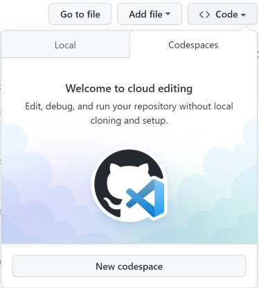

# Azure Developer CLI template - Base Platform One / Big Bang (AKS) Software Factory Deployment

This is the [AZD](https://learn.microsoft.com/en-us/azure/developer/azure-developer-cli/overview) [Platform One](https://p1.dso.mil/services/big-bang) (AKS) template. This solution is based off Big Bang's customer [template](https://repo1.dso.mil/platform-one/big-bang/customers/template).

## Customer Use-Case

Platform Teams seeking to onboard Software Factories like Platform One involves a complex setup process requiring deep technical expertise with limited dev tools available to help automate the journey.

Platform and Application Dev teams can use [Azure Developer CLI](https://learn.microsoft.com/en-us/azure/developer/azure-developer-cli/overview) to help simplify and accelerate their code to cloud journey. AZD helps simplify platform and application onboarding while promoting consistency, reuse and ease of maintenance.

This template has been customized to scale and integrate with Azure [AKS](https://azure.microsoft.com/en-us/products/kubernetes-service/). This solution is pre-packaged with a CLI interface which guides operators along the deployment process and minimizes setup configuration variables.

AZD is a command line tool that accelerates the process of building apps on Azure by providing developer-friendly commands that help automate each stage of the developer workflow and reduces the cognitive load for developers.

## What is included in this repository

The repository hosts of the following components:

- Azure Developer CLI configuration
- Placeholder for an application `src\app\`
- Starter Baseline Platform One [Configuration](./src/platform-dialtone/manifests/bigbang.configmap.yaml.template)

To understand more about the Azure Developer CLI architecture and to create a similar template, you can refer to [Make your project compatible with Azure Developer CLI](https://learn.microsoft.com/en-us/azure/developer/azure-developer-cli/make-azd-compatible?pivots=azd-create).

### Azure Developer CLI configuration

The template uses Bicep and the [Azure Developer CLI](https://learn.microsoft.com/azure/developer/azure-developer-cli/overview) (`azd`). The [azure.yaml](./azure.yaml) schema defines and describes the apps and types of Azure resources that are included in these templates. More information about AZD's azure.yaml schema can be found [here](https://learn.microsoft.com/en-us/azure/developer/azure-developer-cli/azd-schema).

The following infrastructure resources defined as Bicep templates in the `infra` folder are created:

- Azure Kubernetes Service (AKS) cluster
- Azure Container Registry
- Azure Keyvault
- Azure Monitor managed service for Prometheus

The template uses the following [event hooks](https://learn.microsoft.com/azure/developer/azure-developer-cli/azd-extensibility) to customize the workflow:

- [preprovision](./infra/azure/azd-hooks/preprovision.sh) to make sure that all the required AKS features are registered. Also, collects Github + Iron Bank creds.
- [postprovision](./infra/azure/azd-hooks/postprovision.sh) installs the big bang configuration and certificates onto the AKS cluster
- [postpipelineconfig](./infra/azure/azd-hooks/postpipelineconfig.sh) installs the big bang configuration and certificates onto the AKS cluster

## Technical Background - Intended for Platform / Infra Team Audience

### Big Bang Architecture

#### Network Ingress Diagram

##### Goals of this Architecture Diagram - Help new users better understand:

- That the CNI component of Kubernetes creates an Inner Cluster Network.
- Kubernetes Ingress (How network traffic flows from LAN to Inner Cluster Network)
- How Big Bang is leveraging Istio Operator
- Network Encryption in the context of Big Bang (HTTPS, mTLS, and spots where Network Encryption is not present by default.)


## Platform Deployment  - Intended for Platform / Infra Team Audience

### Prerequisites

#### Azure Account
You'll need an Azure account as this project deploys various cloud resources like a VNET, AKS and an Azure Key Vault. For those that don't have an Azure account, you can follow these [instructions](https://learn.microsoft.com/en-us/training/modules/create-an-azure-account/) to help get you started.

#### VS Code
This project includes a VSCode dev container to help automate the setup of the required tools. VSCode can be downloaded [here](https://code.visualstudio.com/download).

#### Iron Bank Credentials
The Big Bang software factory Helm chart pulls it's platform docker images from the Iron Bank registry. Each deployment requires Iron Bank credentials to be provided as secrets in the Github repository. Follow these [instructions](https://login.dso.mil/auth/realms/baby-yoda/protocol/openid-connect/registrations?client_id=account&response_type=code) for setting up a new Iron Bank account. The setup wizard will prompt the deployment operator for the iron bank username and password credentials.

#### Azure Developer CLI
Follow these [instructions](https://learn.microsoft.com/azure/developer/azure-developer-cli/install-azd) to install the Azure Developer CLI onto your workstation

#### Github Access Token
[create a GitHub personal access token (PAT)](https://docs.github.com/en/authentication/keeping-your-account-and-data-secure/creating-a-personal-access-token) with `repo`, `write:package` and `workflow` scopes. If you are part of a single sign-on (SSO) organization, you may need to authorize your PAT using `Configure SSO`.

## Install


### Azure Login

Login to your Azure Tenant

```sh
azd auth login —tenant-id <replace-with-your-tenant-id>
az login -t <replace-with-your-tenant-id>
```

#### Optional - Service Principal Usage
You can create a new service principal using the Azure CLI (listed below). Follow these [instructions](https://learn.microsoft.com/en-us/azure/developer/azure-developer-cli/reference#azd-auth-login) to use an existing service principal for the AZD infrastructure deployment.

```sh
az ad sp create-for-rbac --name <replace-with-your-sp-name> --role owner --scopes /subscriptions/<replace-with-your-target-subscription-id> --sdk-auth
```

### Initializing the template

If you are starting from this end state repo, use `azd init` to clone this template locally.

```sh
mkdir my-platform
cd my-platform
azd init -t cse-labs/azd-platform-one-aks-template
```

#### Local Workstation Usage - Option 1: Setup Local Dev Container
Start VS Code from the cloned `ie my-platform` folder, run the Dev Containers: Open Folder in Container... command from the Command Palette (F1) or quick actions Status bar item, and select the project folder you would like to set up the container for.


#### Local Workstation Usage - Option 2: Open with Codespaces

- Click the `Code` button on this repo
- Click the `Codespaces` tab
- Click `New Codespace`



### Provision the Infrastructure
Deploy the infrastructure by running `azd provision`. This step will prompt the developer for the following information:

- Project Environment Name
- Cloud subscription and location
- Github Profile Credentials / Github PAT
- IronBank Username / Password
- GitOps Repository Target

```sh
azd provision
```

### Continuous integration/continuous deployment


The workflow [azure-dev.yaml](./.github/workflows/azure-dev.yaml) uses the Azure Developer CLI container image which has the CLI installed to login to the Azure environment with `azd login`, provision the infrastructure with `azd provision`.

To configure the GitHub repository with the secrets needed to run the pipeline, you'll need to run `azd pipeline config`.

Since the infrastructure template requires setting up some role assignments, the created service principal will need to have `Owner` permissions on the resource group.

```sh
azd pipeline config --principal-role Owner 
```

Once you do so, and if you commit your changes, you should see the pipeline running to build and deploy your application.

#### Configure Control Plane Secrets and Environment Variables

This solution provides a post pipeline setup script which uploads the required variables and secrets to the Github Repository. You'll be able to run the Github Action workflow once you run the below script:

```sh
chmod -R +x ./infra/azure/azd-hooks/postpipelineconfig.sh && ./infra/azure/azd-hooks/postpipelineconfig.sh
```

## Big Bang Usage

### Application Onboarding

Follow the instructions in the [Big Bang Application Onboarding Guide](https://github.com/cse-labs/azd-python-p1-service-template) to onboard your application to your cluster.

###  Local Workstation Testing Only - Configure local domain to IP address mapping
The Big Bang deployed platform services are accessible by dns entries like kiali.bigbang.dev, grafana.bigbang.dev, etc.

In development, when using a domain name not recorded in a DNS server, if we want to access the virtual services created by Bigbang, we can add the IP address - domain mapping to /etc/hosts running the following commands:

```sh
# get istio gateway ip address
ip=$(kubectl -n istio-system get service public-ingressgateway -o jsonpath='{.status.loadBalancer.ingress[0].ip}')

# get big bang deployed domains
domains=$(kubectl get virtualservices  -A -o jsonpath="{ .items[*].spec.hosts[*] }")

# add entry in /etc/hosts
echo "$ip $domains" | sudo tee -a /etc/hosts
```

### Export Public Certificate from Bigbang Cluster

```sh
kubectl get secret -n istio-system public-cert -o jsonpath="{.data['tls\.crt']}" | base64 -d > public-cert.crt
```

You'll need to import the above exported certificate into your local OS keychain. Here are the instructions for [Mac Users](https://support.apple.com/guide/keychain-access/add-certificates-to-a-keychain-kyca2431/mac) and [Windows Users](https://support.globalsign.com/ssl/ssl-certificates-installation/import-and-export-certificate-microsoft-windows).

Before moving to Production, you'll want to choose a certificate authority to generate and validate your SSL / TLS certificate. You can import the public certificate and private key into the Azure Keyvault Instance used for this deployment.

## See Also

- [Big Bang Application Onboarding Guide](https://github.com/cse-labs/azd-python-p1-service-template)
- [Credentials for Big Bang Packages](https://repo1.dso.mil/platform-one/big-bang/bigbang/-/blob/master/docs/guides/using-bigbang/default-credentials.md#packages-with-built-in-authentication)
- [Big Bang Package Architecture](https://repo1.dso.mil/platform-one/big-bang/bigbang/-/tree/master/docs/understanding-bigbang/package-architecture#dependency-tree)
- [Big Bang Configuration Overview](https://repo1.dso.mil/platform-one/big-bang/bigbang/-/blob/master/docs/understanding-bigbang/configuration/configuration.md)
